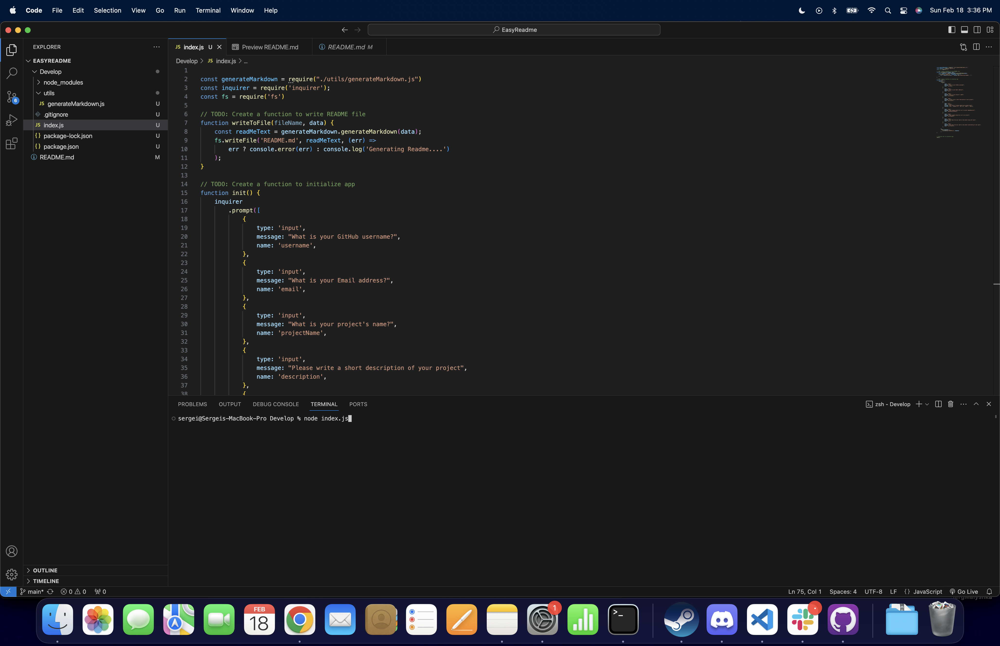
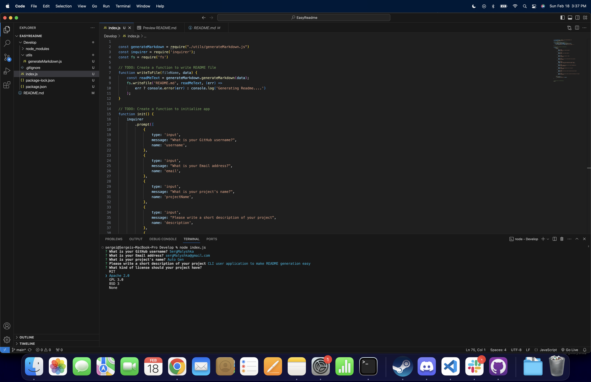

# Auto Readme

## Description

Making ReadMe's is the most frustrating portion of any application. Auto Readme is a CLI driven Readme generator, that will take in user input to answer specific questions and generate the readme for you

## Table of Contents

- [Installation](#installation)
- [Usage](#usage)
- [Credits](#credits)
- [License](#license)
- [Video](#video)

## Installation

`npm i` is a command that should be run to install all necessary packages the application is dependent on

## Usage

After the installation is complete, simply run `node index.js` and follow all the prompts until the end

## Credits

Done by Serg Malyshka

## License

This project is ran under the standard MIT license

## Video
https://drive.google.com/file/d/1kehyC4-IG3-0ymKgJ1sUOLt5MJ2MWmvF/view
